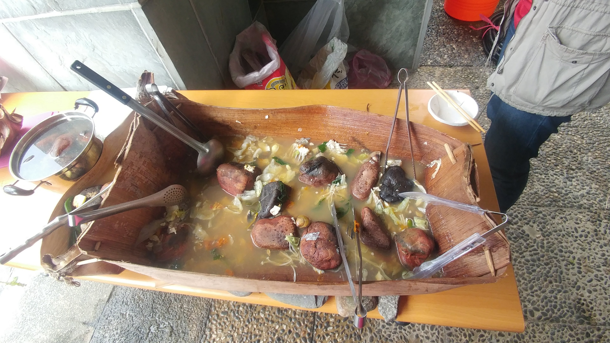

# Biodegradable-objects-made-of-local-plants

## The aim of this project is to gather information on the properties of the plants selected to make ropes and basketry.
## These multi-functional objects extend the fibrous properties of plants, and often offer practical and sustainable solutions to the problems of over-exploitation and misuse of petrochemical materials. 

The idea was inspired by observing locals during fieldwork in South-East Asia for my PhD thesis. For example, the Areca palm can hold liquids, in this case soup, without leaking (Fig.1) and the Abaca banana fibre can be used as a bandage because it sticks to the skin and has antiseptic properties (Fig.2).

`Figure 1. Boulder soup container is made of the palm tree Areca sp. by the Rukai  people in Taiwan.` 

`Figure 2.  Musa textilis - Abaca fiber used into bandage by the people from Sorsogon, Philippines.`

## Methods
I propose to interview basket-makers and to study museum collections which preserved baskets to gather data on the properties of local fibrous plants. 
The goal is to select plants whose use and origin are clearly identified (status of the plant: indigenous, introduced, invasive) in order to create a database. Plant fibers have specific features such as length, shape or cellulose or lignin content that defines their properties. Therefore, the aim of this database is to document the specific anatomical properties and chemical content (UMR IATE, Montpellier) of local plants. 

## Expected outcomes

This work will: 
(1) document useful local plants from a multidisciplinary point of view and (2) improve the characterisation of botanical remains from archaeological contexts and plant objects preserved in museum collections. 
(3) On the basis of the results obtained, prototypes of biodegradable (not just recyclable) objects will be created, in order to offer a local alternative to plastic objects. This project could serve to better protect endangered local species by controlling the proliferation of invasive ones.

